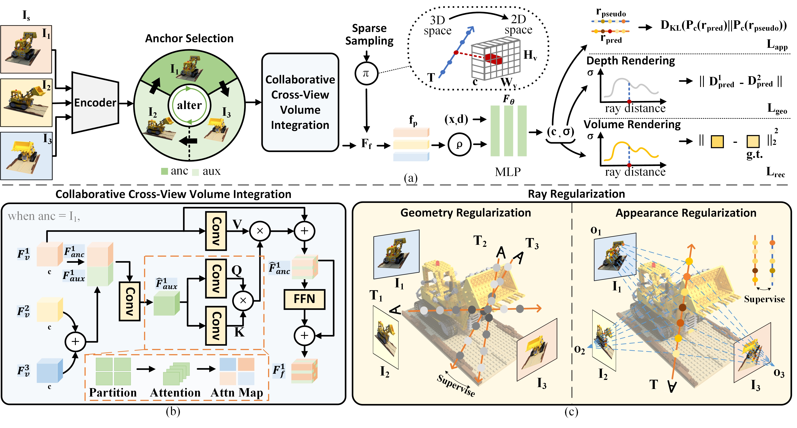

# ColNeRF: Collaboration for Generalizable Sparse Input Neural Radiance Field

#### Association for the Advancement of Artificial Intelligence (AAAI), 2024

[Zhangkai Ni](https://eezkni.github.io/)<sup>1</sup>, Peiqi Yang<sup>1</sup>, [Wenhan Yang](https://flyywh.github.io/)<sup>2</sup>, [Hanli Wang](https://scholar.google.com/citations?user=WioFu64AAAAJ&hl=zh-CN)<sup>1</sup>, [Lin Ma](http://forestlinma.com/)<sup>3</sup>, [Sam Kwong](https://scholar.google.com/citations?user=_PVI6EAAAAAJ&hl=zh-CN)<sup>4</sup>

<sup>1</sup>Tongji University, <sup>2</sup>Peng Cheng Laboratory, <sup>3</sup>Meituan, <sup>4</sup>City University of Hong Kong

This repository provides the official PyTorch implementation for the paper "ColNeRF: Collaboration for Generalizable Sparse Input Neural Radiance Field," AAAI-2024. [Paper](https://arxiv.org/abs/2312.09095)



## About ColNeRF
Neural Radiance Fields (NeRF) have demonstrated impressive potential in synthesizing novel views from dense input, however, their effectiveness is challenged when dealing with sparse input. Existing approaches that incorporate additional depth or semantic supervision can alleviate this issue to an extent. However, the process of supervision collection is not only costly but also potentially inaccurate. In our work, we introduce a novel model: the Collaborative Neural Radiance Fields (ColNeRF) designed to work with sparse input. The collaboration in ColNeRF includes the cooperation among sparse input source images and the cooperation among the output of the NeRF. Through this, we construct a novel col- laborative module that aligns information from various views and meanwhile imposes self-supervised constraints to ensure multi-view consistency in both geometry and appearance. A Collaborative Cross-View Volume Integration module (CCVI) is proposed to capture complex occlusions and implicitly infer the spatial location of objects. Moreover, we introduce self-supervision of target rays projected in multiple directions to ensure geometric and color consistency in adjacent regions. Benefiting from the collaboration at the input and output ends, ColNeRF is capable of capturing richer and more generalized scene representation, thereby facilitating higher-quality results of the novel view synthesis. Our extensive experimental results demonstrate that ColNeRF outperforms state-of-the-art sparse input generalizable NeRF methods. Furthermore, our approach exhibits superiority in finetuning towards adapting to new scenes, achieving competitive performance compared to per-scene optimized NeRF-based methods while significantly reducing computational costs.

**TL;DR:** We introduce the conception of collaboration in NeRF, which includes the cooperation among sparse input source images and the cooperation among the output of the NeRF to improve few-shot neural rendering. 


## Experimental Results

<div align="center">  </div>

<div align="center">  </div>


## Environment setup
To start, we prefer creating the environment using conda:
```sh
conda env create -f environment.yml
conda activate colnerf
```
Please make sure you have up-to-date NVIDIA drivers supporting CUDA 10.2 at least.

Alternatively use `pip -r requirements.txt`.


## Getting the data
### DTU Dataset
**Image Data:** Please download the Rectified image and pose data from [the official publication](https://roboimagedata.compute.dtu.dk/?page_id=36).


### LLFF dataset
**Image Data:** Please use [the official download link](https://drive.google.com/drive/folders/128yBriW1IG_3NJ5Rp7APSTZsJqdJdfc1) from the [NeRF repository](https://github.com/bmild/nerf) for downloading the LLFF dataset.


## Running the model (video generation)
The main implementation is in the `src/` directory,
while evalutation scripts are in `eval/`.

First, download all pretrained weight files from
<https://drive.google.com/drive/folders/12OKCls3cSIHZKXCkAukFIsmE1mcSufEn?usp=drive_link>.
Extract this to `<project dir>/checkpoints/`.


### DTU
Make sure you have downloaded the pretrained weights above, so that `<project dir>/checkpoints/dtu/3v/colnerf_latest` exists. Replace `3v` with `6v` or `9v` to run on a different number of input source views.

1. Download DTU dataset from Google drive folder in Datasets section. Extract to some directory, to get: `<data_root>/rs_dtu_4`
2. Run using `python eval/gen_video.py -n dtu -c ./conf/exp/dtu.conf --gpu_id=<GPU(s)> --split val -P '22 25 28' -V 3 -D <data_root>/rs_dtu_4 -S 3 --scale 0.25`

Replace `<GPU(s)>` with desired GPU id(s). Replace `-S 3` with `-S <scene_id>` to run on a different scene. This is not DTU scene number but 0-14 in the val set. 
Remove `--scale 0.25` to render at full resolution (quite slow).

**Result will be at** visuals/dtu/3v/videov<scene_id>.mp4.
The script will also print the path.

Note that for DTU, we only use train/val sets, where val is used for test. This is due to the very small size of the dataset.
The model overfits to the train set significantly during training.


### LLFF
Make sure you have downloaded the pretrained weights above, so that `<project dir>/checkpoints/llff/fern/3v/colnerf_latest` exists. Replace `3v` with `6v` or `9v` to run on a different number of input source views. Replace `fern` with `<scene>` to run on a different scene.

1. Download LLFF dataset from Google drive folder in Datasets section. Extract to some directory, to get: `<data_root>/nerf_llff_data`
2. Run using `python eval/gen_video.py -n fern -G llff -c ./conf/exp/llff.conf --gpu_id=<GPU(s)> -V 3 -D <data_root>/nerf_llff_data/fern --scale 0.25`

Replace `<GPU(s)>` with desired GPU id(s). Replace `-V 3` with desired number of input views. Due to the varying number of source images in each scene of the LLFF dataset, we randomly select source views. Replace `fern` with `<scene>` to run on a different scene. 
Remove `--scale 0.25` to render at full resolution (quite slow).

**Result will be at** visuals/llff/3v/videov<scene_id>.mp4.
The script will also print the path.

Note that for LLFF, we utilize the model pretrained on DTU and further fine-tune it on each scene of the LLFF dataset, resulting in corresponding models.


## Overview of flags
Generally, all scripts in the project take the following flags
- `-n <expname>`: experiment name, matching checkpoint directory name
- `-D <datadir>`: dataset directory. 
    To save typing, you can set a default data directory for each expname in `expconf.conf` under `datadir`..
- `--split <train | val | test>`: data set split
- `-S <subset_id>`: scene or object id to render
- `-G <group name>`: group some experiments together
- `--gpu_id <GPU(s)>`: GPU id(s) to use, space delimited. All scripts except `calc_metrics.py`
are parallelized. If not specified, uses GPU 0.
Examples: `--gpu_id=0` or `--gpu_id='0 1 3'`.
- `-R <sz>`: Batch size of rendered rays per object. Default is 50000 (eval) and 128 (train); make it smaller if you run out of memory.  On large-memory GPUs, you can set it to 100000 for eval.
- `-c <conf/*.conf>`: config file. *Automatically inferred* for the provided experiments from the expname. Thus the flag is only required when working with your own expnames. You can associate a config file with any additional expnames in the `config` section of `<project root>/expconf.conf`.

Please refer the the following table for a list of provided experiments with associated config and data files:

| Name                       | expname -n    | config -c (automatic from expconf.conf)   | Data file                               | data dir -D       |
|----------------------------|---------------|-------------------------------------------|-----------------------------------------|-------------------|
| DTU                        | dtu           | conf/exp/dtu.conf                  | dtu_dataset.zip                         | path/rs_dtu_4     |
| LLFF                 | llff      | conf/exp/llff.conf             | nerf_llff_data.zip        | path/nerf_llff_data/scene              |


## Quantitative evaluation instructions
All evaluation code is in `eval/` directory.
The full, parallelized evaluation code is in `eval/eval.py`.

### Full Evaluation
Here we provide commands for full evaluation with `eval/eval.py`.
After running this you should also use `eval/calc_metrics.py`, described in the section below,
to obtain final metrics.

Append `--gpu_id=<GPUs>` to specify GPUs, for example `--gpu_id=0` or `--gpu_id='0 1 3'`.
**It is highly recommended to use multiple GPUs if possible to finish in reasonable time.**
Resume-capability is built-in, and you can simply run the command again to resume if the process is terminated.

For DTU, a source-view specification is required. This can be either `-P` or `-L`. `-P 'view1 view2..'` specifies
a set of fixed input views. In contrast, `-L` should point to a viewlist file (viewlist/src_*.txt) which specifies views to use for each object.

Renderings and progress will be saved to the output directory, specified by `-O <dirname>`.


#### DTU
- 3-view `python eval/eval.py -D <data>/rs_dtu_4 --split val -n dtu -c ./conf/exp/dtu.conf -P '22 25 28' -O eval_out/dtu_3v`
- 6-view `python eval/eval.py -D <data>/rs_dtu_4 --split val -n dtu -c ./conf/exp/dtu.conf -P '22 25 28 40 44 48' -O eval_out/dtu_6v`
- 9-view `python eval/eval.py -D <data>/rs_dtu_4 --split val -n dtu -c ./conf/exp/dtu.conf -P '22 25 28 40 44 48 0 8 13' -O eval_out/dtu_9v`


#### LLFF
- 3-view `python eval/eval_llff.py -D <data>/nerf_llff_data -n llff -c ./conf/exp/llff.conf -V 3 -O eval_out/llff_3v`
- 6-view `python eval/eval_llff.py -D <data>/nerf_llff_data -n llff -c ./conf/exp/llff.conf -V 6 -O eval_out/llff_6v`
- 9-view `python eval/eval_llff.py -D <data>/nerf_llff_data -n llff -c ./conf/exp/llff.conf -V 9 -O eval_out/llff_9v`


### Final Metric Computation
The above computes PSNR and SSIM without quantization. The final metrics we report in the paper
use the rendered images saved to disk, and also includes LPIPS + category breakdown.
To do so run the `eval/calc_metrics.py`, as in the following examples

- DTU: `python eval/calc_metrics.py -D <data dir>/rs_dtu_4/DTU -O eval_out/dtu_3v -F dvr --list_name 'new_val' --exclude_dtu_bad --dtu_sort`
- LLFF: `python eval/calc_metrics.py -D <data dir>/nerf_llff_data -O eval_out/llff_3v -F llff`

Adjust -O according to the -O flag of the eval.py command.


## Training instructions
Training code is in `train/` directory, specifically `train/train.py`.

- Example for training to DTU: `python train/train.py -n dtu_exp -c conf/exp/dtu.conf -D <data dir>/rs_dtu_4 -V 3 --gpu_id=<GPU> --resume --color_reg --density_reg`

Additional flags
- `--resume` to resume from checkpoint, if available. Usually just pass this to be safe.
- `-V <number>` to specify number of input views to train with. Default is 1.
    - `-V 'numbers separated by space'` to use random number of views per batch. This does not work so well in our experience.
- `-B <number>` batch size of objects, default 4
- `--color_reg` if use appearance ray regularization
- `--density_reg` if use geometry ray regularization
- `--lr <learning rate>`, `--epochs <number of epochs>`

If the checkpoint becomes corrupted for some reason (e.g. if process crashes when saving), a backup is saved to `checkpoints/<expname>/colnerf_backup`.
To avoid having to specify -c, -D each time, edit `<project root>/expconf.conf` and add rows for your expname in the config and datadir sections.


### Log files and visualizations
View logfiles with `tensorboard --logdir <project dir>/logs/<expname>`.
Visualizations are written to  `<project dir>/visuals/<expname>/<epoch>_<batch>_vis.png`.
They are of the form
- Top coarse, bottom fine (1 row if fine sample disabled)
- Left-to-right: input-views, depth, output, alpha.


## Citation
If you find our work useful, please cite it as
```
@article{ni2023colnerf,
  title={ColNeRF: Collaboration for Generalizable Sparse Input Neural Radiance Field},
  author={Ni, Zhangkai and Yang, Peiqi and Yang, Wenhan and Ma, Lin and Kwong, Sam},
  journal={arXiv preprint arXiv:2312.09095},
  year={2023}
}
```


## Acknowledgments
This code is inspired by [PixelNeRF](https://github.com/sxyu/pixel-nerf). We thank the authors for the nicely organized code!


## Contact
Thanks for your attention! If you have any suggestion or question, feel free to leave a message here or contact Dr. Zhangkai Ni (eezkni@gmail.com).


## License
[MIT License](https://opensource.org/licenses/MIT)
